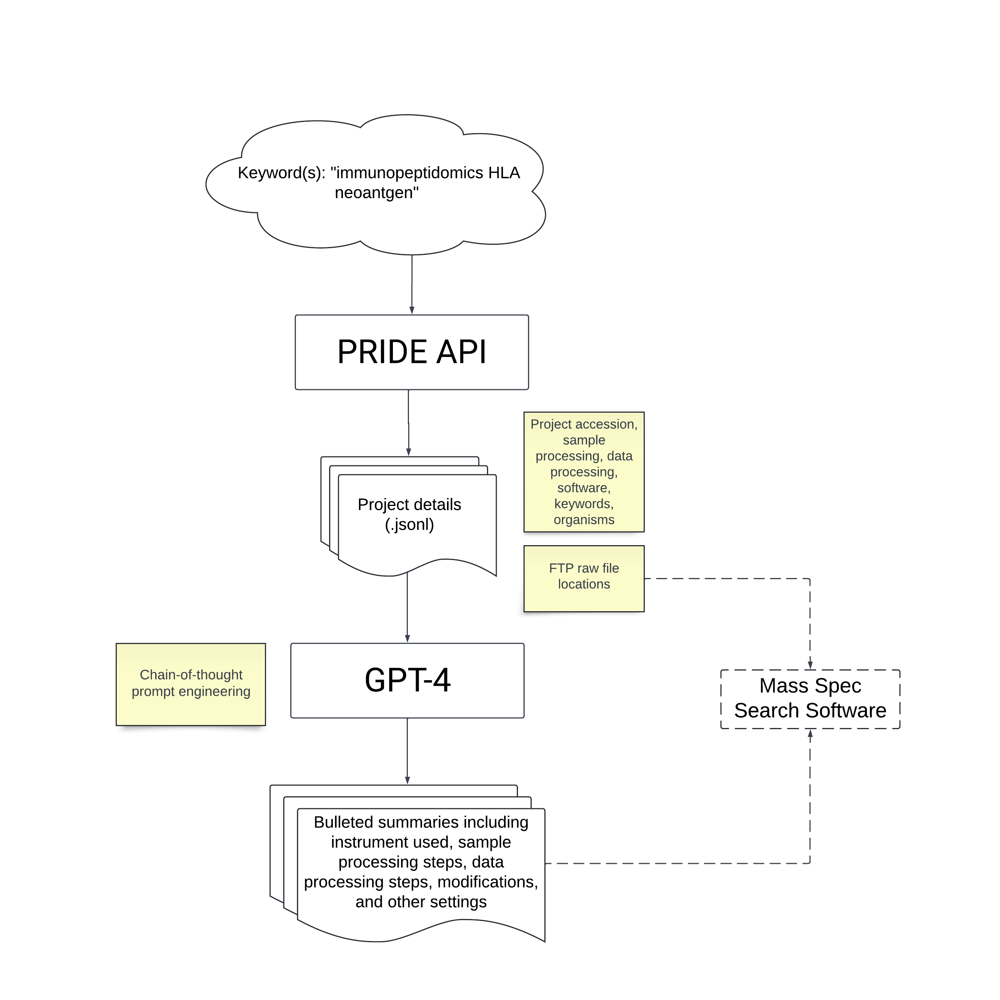

# pride_mine

Mine the PRIDE repository for projects matching keyword(s). \
Output descriptions are input for GPT-4 to generate concise summaries of information relevant for data searching. \
The FTP locations of relevant projects can be used in downstream processing.

