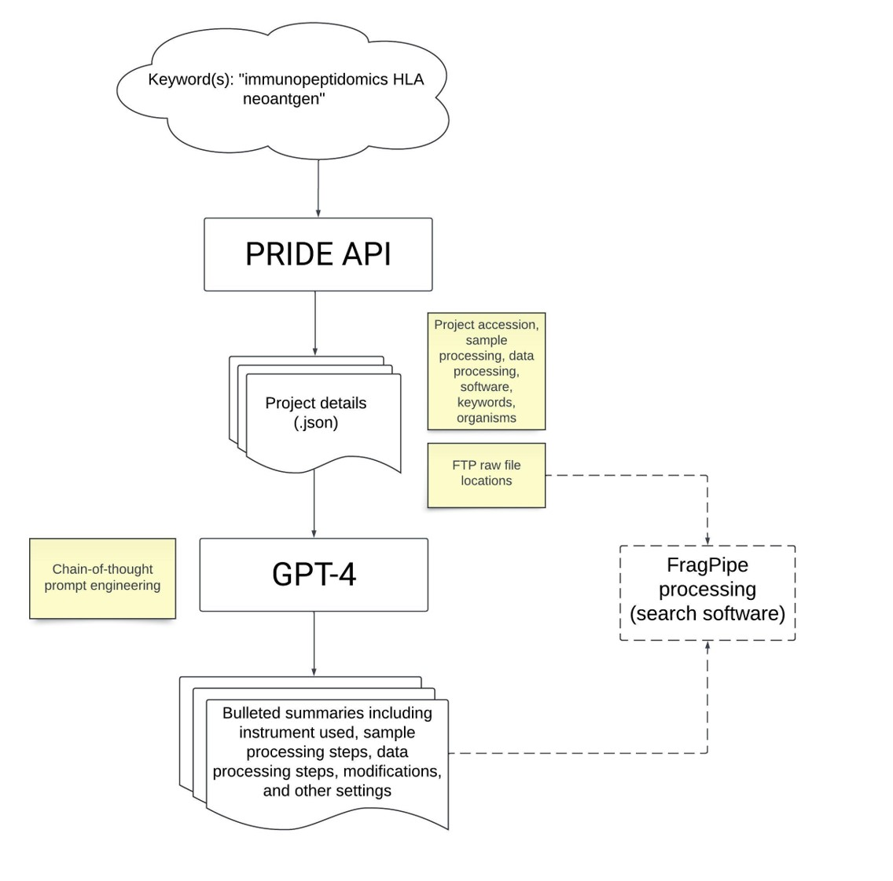

# pride_mine

Mine the PRIDE repository for projects matching keywords(s). Output descriptions are input for GPT-4 to generate concise summaries of information relevent to data searching.
The FTP locations of relevent projects can be used in downstream processing.

