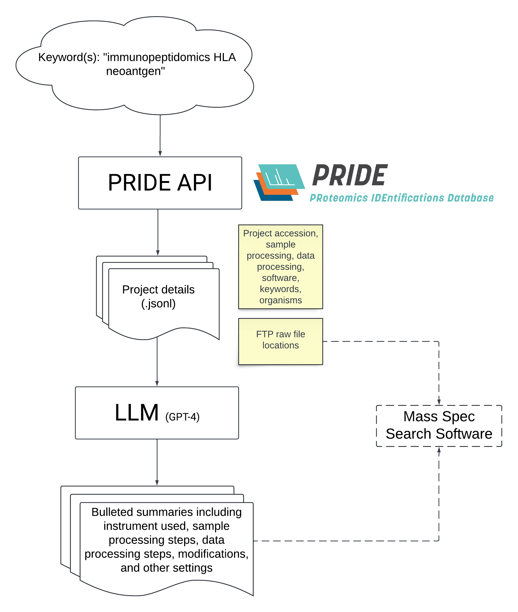
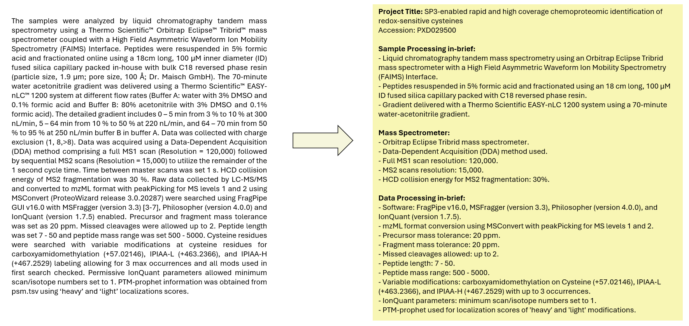

# Mine PRIDE

Mine the PRIDE repository for projects matching keyword(s). \
Output descriptions are input for LLM to generate concise summaries of information relevant for data searching. \
The FTP locations of relevant projects can be used in downstream processing.



## Example of project description summary


## To run
- Obtain an Open AI Key for line 77 of get_summaries.py
- Run using get_summaries.py
  
  ```
  python get_summaries.py "keywords"
  ```

## Output
Matching project summaries are printed, and matching project details are stored in output.jsonl
